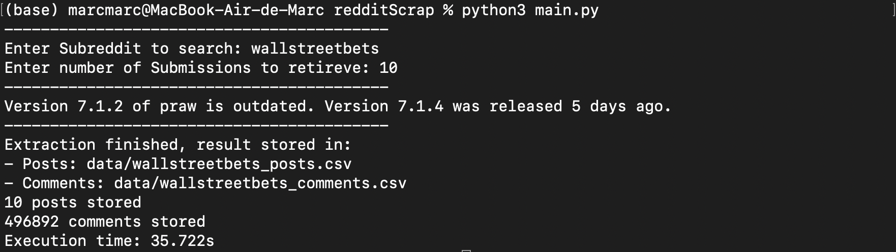
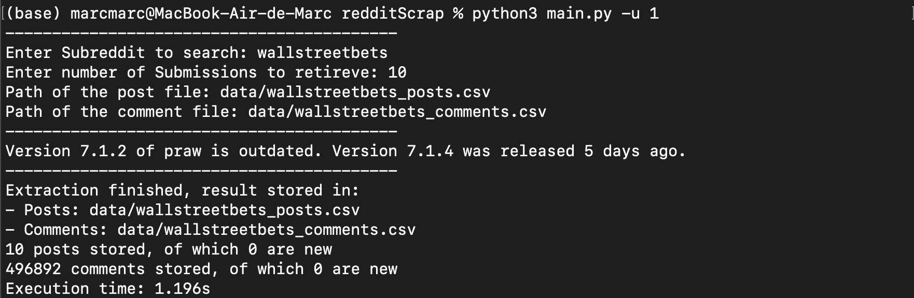
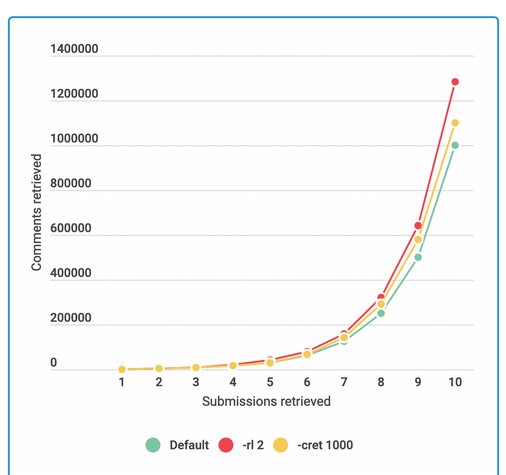

# Reddit Scrapper

Reddit Scrapper is a tool to extract data from Reddit. It's used from a terminal and it's aimed to be an easy and relatively fast way to download massive quantities of text and metadata from any subreddit.

The objective of this tool is to create datasets (mainly focused on text) that can be useful for machine learning and NLP purposes. 
Reddit data allows access to massive communities involving millions of people in some cases, this project is a first step to explore the capabilities of the enormous quantity of open source data and how it can be used to extract knowledge from the chaos.

## What can be downloaded
Reddit is organized in _subreddits_,  communities where users can post _submissions_. _Submissions_ are posts that contain text and sometimes images, and can be commented by other users.
_Comments_ of a submission have a **forest structure**, each comment can be commented indefinitely, creating layers with different depth levels.
Also, both comments and submissions can be rated by all users with *upvotes* (positive votes) and *downvotes* (negative votes), creating a score rating.
 
The program generates two `.csv` files, one where submissions are stored and one where comments are stored:

Submission data structure:
* `ID`: Identificator of the submission 
* `Title` 
* `Text`
* `Score` : Total rating of the post
 * `UpvoteRatio`
* `NumberComments`
* `Author` 
* `Timestamp` : Date of the creation of the submission

Comment data structure:
* `ID`
* `Text`	
* `Score`
* `Author`
* `isRoot`: Boolean value, true if the comment is top-level
* `Timestamp`: Date of the creation of the comment
* `SubmissionID`: ID of the submission where the comment belongs

## How it works
The program is used from the terminal, it has several flags that allow to add extra requirements. Basic information of the existing flags can be found with:
```
>% python3 main.py --help
```
After entering the command, it will ask the user for input, the name of the desired subreddit and the number of submissions to retrieve:

<p align="center">
  
</p>


There's also the option to input a pair of already created datasets to update them with new posts.

<p align="center">
  
</p>

Flags:
* `-rl` , **Replace limit**: Number of batches of comments retrieved for every top-level comment. The default value is 1, and bigger values exponentially increase the number of comments retrieved and execution time.
* `-c` : Choose if comments have to be retrieved. Default value is True, with `-c 0` comments won't be retrieved, and a comment dataset won't be created. 
* `-csort`, **Comment Sort**: Way in which the comments are sorted, it can be *best*(default), *new* or *controversial*. 
* `-cret`, **Comments Retrieved**: Number of top-level comments retrieved for submission. Default value is 500.
* `-u`, **Update**: Choose to update previous datasets. False by default.
* `-sf`, **Saving Frequency**: Frequency in read submission to save backup copy. This functionality allows to periodically save copies of retrieved data during long executions to minimize possible data loss. By  default it's 10.

## Complexity observations
Due to the forest structure of comments threads, the number of comments grows very fast. Modifying the default parameters will in most case make the number of comments grow much faster.
The complexity is $O(c)$, where $c$ is the number of retrieved comments. So it's important to consider that the execution time will grow as fast as the number of comments retrieved.

<p align="center">
  
</p>

## Future work
* Adding the capability of updating datasets based on timestamp. This will allow the updated datasets to grow faster.

* Allow the update of comments from submissions that have been already retrieved, this will allow to avoid losing new comments on old submissions. For this to be possible, an effective way of timestamp filtering for comments already saved is necessary, and there needs to be a fast way to iterate through stored comments.
* Add the option to enter a url as a way of choosing submissions or subreddits to retrieve. 
